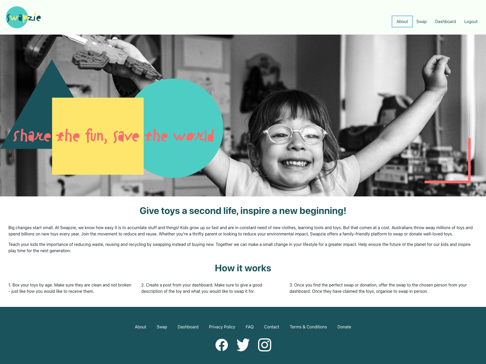
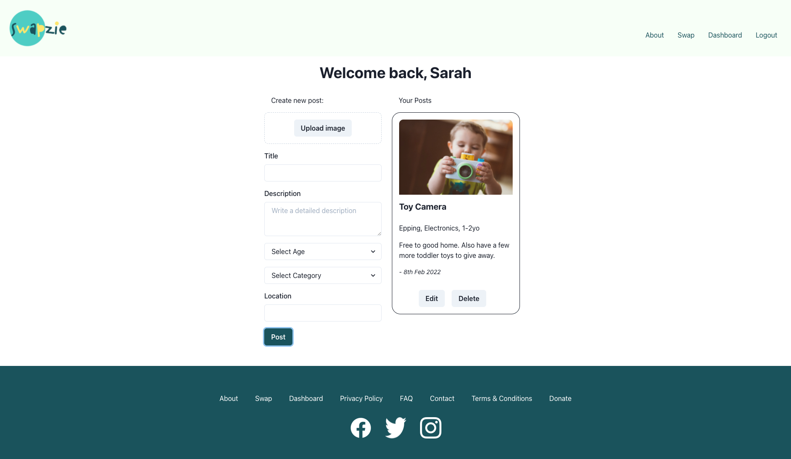
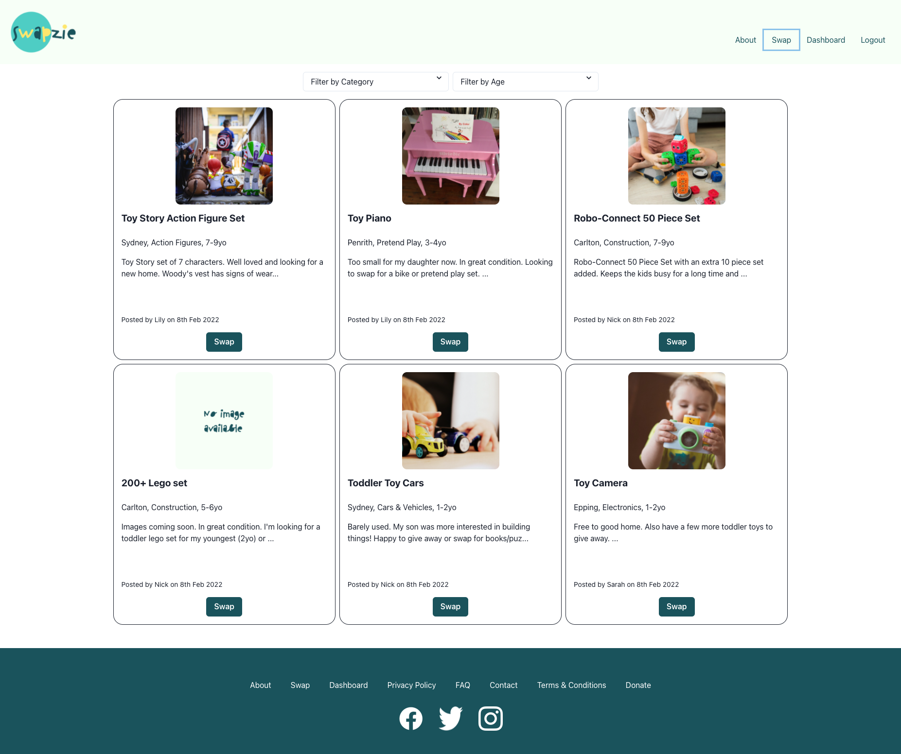
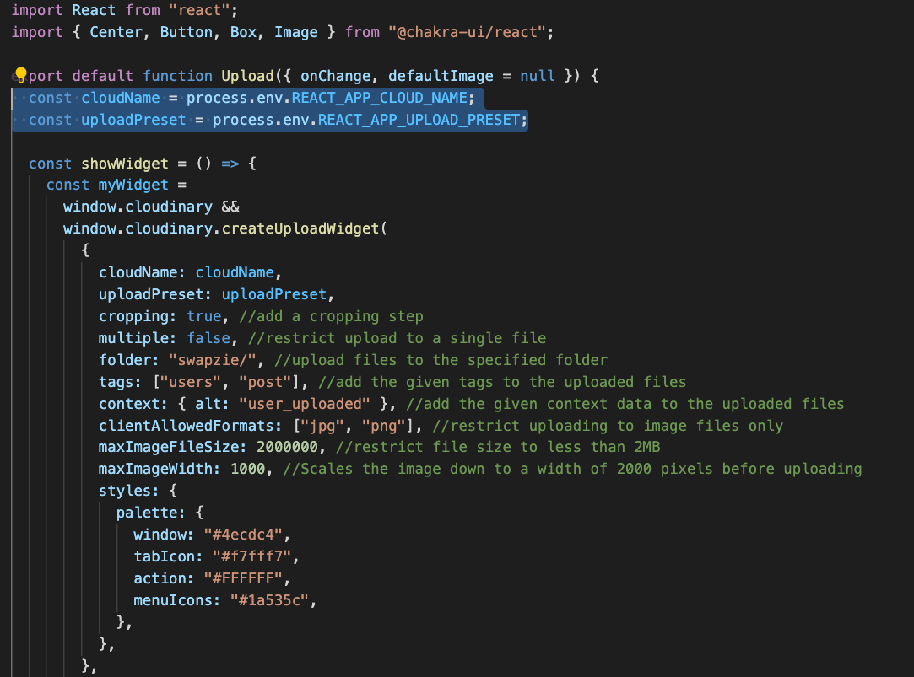
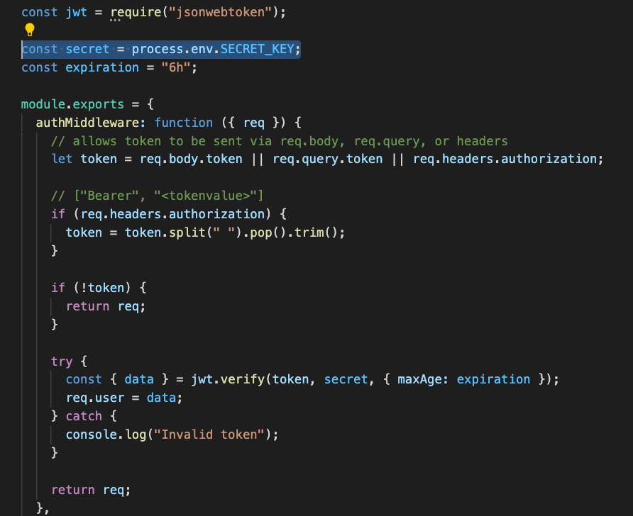

# swapzie

> Share the fun, save the world. Swapzie - A toy swapping platform built with a MERN stack
> Live demo [_here_](https://swapzie.herokuapp.com/).

## Table of Contents

- [General Info](#general-information)
- [Technologies Used](#technologies-used)
- [Features](#features)
- [Screenshots](#screenshots)
- [Setup](#setup)
- [Project Status](#project-status)
- [Future Development](#future-development)
- [Acknowledgements](#acknowledgements)
- [Contact](#contact)
- [License](#license)

## General Information

- Swapzie offers a platform for parents to swap/donate high quality, age-appropriate toys with other like-minded and thrifty parents.
- The website is a family-friendly platform where users can post their well-loved toys and find them a new home.
- Swapzie was developed to help reduce waste and encourage its users to reuse toys by offering a solution to declutter and also claim "new" toys for the next stage of their children's development.

## Technologies Used

- MongoDB, Mongoose
- Express.js
- React.js
- Node.js
- Apollo
- GraphQL
- JWT
- bcrypt
- Chakra UI
- Cloudinary

## Features

- Users can signup/login and post toys on offer.
- Users can browse posts and filter by category or age.
- Users can post, edit, delete postings.
- Users can comment, and edit comment and delete comments their own comments.

## Screenshots





## Setup

This project uses a MongoDB database. Please see the [documentation](https://docs.mongodb.com/) for more information. The images are managed by Cloudinary and require an account to set up the image uploading image. More information [here](https://cloudinary.com/documentation/upload_widget).

Once repo has been cloned, install all dependencies by running the following from the root of the project.

```shell
npm i
```

or

```
yarn
```

When running in development mode, make sure to set the proxy and check configuration for Graphql.

Set up environment variables for Cloudinary widget at "client/src/cloud/upload.js"



and JWT secret at "server/utils/auth.js".



## Project Status

Project is: _in progress_

## Future Development

- Location selection and filtering
- Messaging function for security and user experience
- Event and play date planner

## Acknowledgements

- Images from [Unsplash](https://unsplash.com/).
- Color scheme from [Coolors](https://coolors.co/).
- Thanks to [n1cklarosa](https://github.com/n1cklarosa) for mentorship.
- And many thanks to [Ben Atkinson](https://github.com/neon-inkblast) and Yun Zhao of Trilogy Education for all the support.

## Contact

Created by [@lilyso](https://github.com/lilyso/swapzie) - feel free to contact me!

## License

This project is open source and available under the [MIT License](LICENSE).
